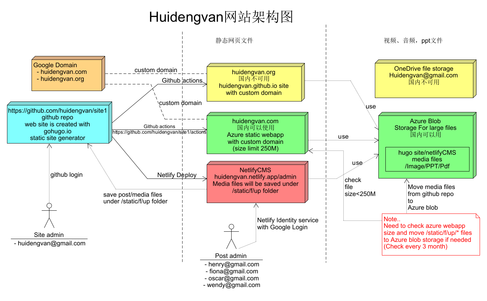

## Huideng Group Vancouver
慧灯小组温哥华

我们的网站网址：
<https://www.huidengvan.com> 
<https://www.huidengvan.org>

网站是基于[hugo](http://www.gohugo.io) 和 Github/GitPages，NetlifyCMS (for post and media file admin), Azure static webapp and Azure blob storage。  

一般的页面和小文件存在<https://github.com/huidengvan/site1>的Git版本仓库中，大的文件存在Azure blob storage。  

<https://www.huidengvan.com> is hosted in Azure static webapp. 

<https://www.huidengvan.org> is hosted in Git Pages <https://pages.github.com/>.

文章发布管理: <https://huidengvan.netlify.app/admin/>

